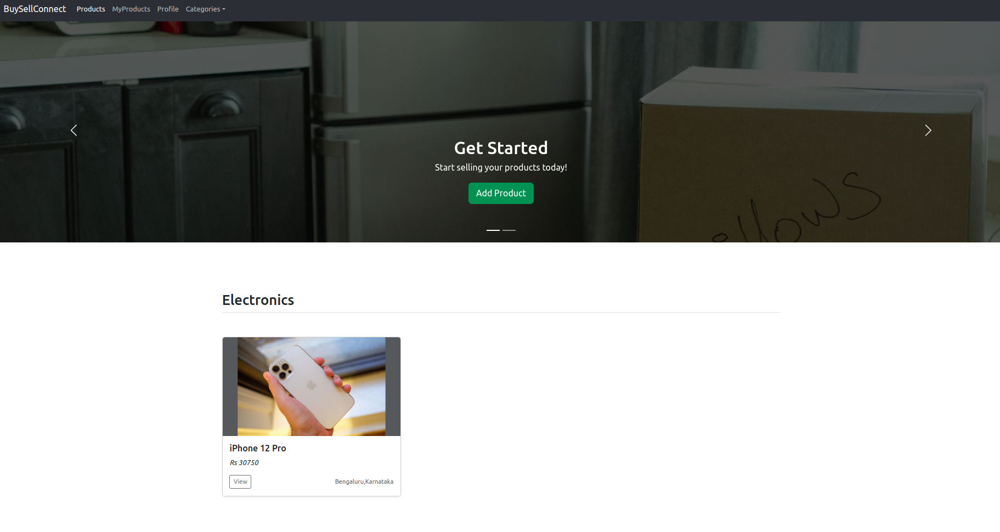

# BuySellConnect

A webapp to help connect buyers and sellers. Users can list their products with relevant information, features and other users can make a request for purchase.

## What it does?

It connects buyers and sellers on this platform. After making a product request, buyer and seller will be notified via their registered email about the product and the seller/buyer info. Users can them connect using the mobile/email for the purchase. It does not include a payment gateway.

## Tech Used

### Frontend

* Bootstrap - it is a popular HTML, CSS, and JavaScript framework for developing responsive, mobile-first websites.
* Thymeleaf - it is a modern server-side Java template engine for both web and standalone environments.

### Backend

#### Java

#### Spring 
The Spring Framework is an application framework and inversion of control container for the Java platform.

#### Spring Boot
Spring Boot Tutorial provides basic and advanced concepts of Spring Framework.

Spring Boot is a Spring module that provides the RAD (Rapid Application Development) feature to the Spring framework. It also comes with Tomcat embedded.

### Database

#### MySQL

MySQL is an open-source relational database management system

## Hosting

AWS (Amazon Web Services)

## Features

* Login Logout, signup, delete account for a user. Spring Security is also used to protect pages.
* Signup is done using SMS and Email OTP verification . I have used fast2sms api for sms messages and outlook smtp email service for sending emails to users.
* User can perform CRUD operation son their listed or added products.
* User can raise a request for a product. Doing that will send a notification mail to both buyer and seller about the request raised. Both buyer and seller if required accept or reject this request.
* Forgot password - After email OTP verification user will receive a randomly generated password in his/her email which can be used for login.
* Change password - User can change password after login.

## Images

> **_NOTE:_**  i might change,reboot or terminate EC2 instance in AWS. So site might not be accesible sometimes.
